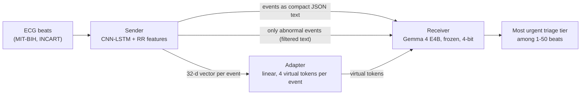
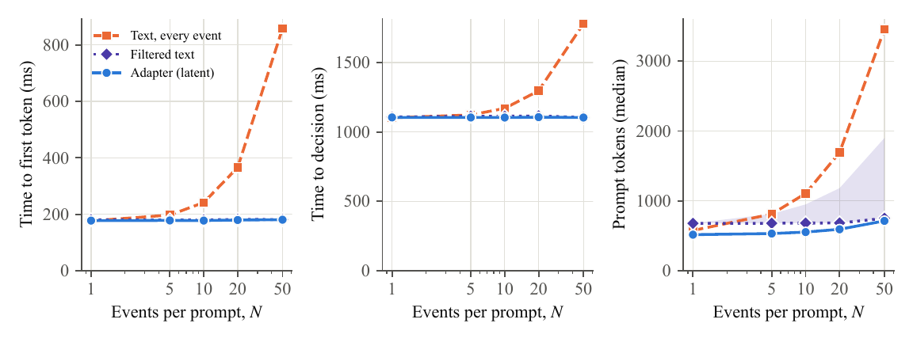
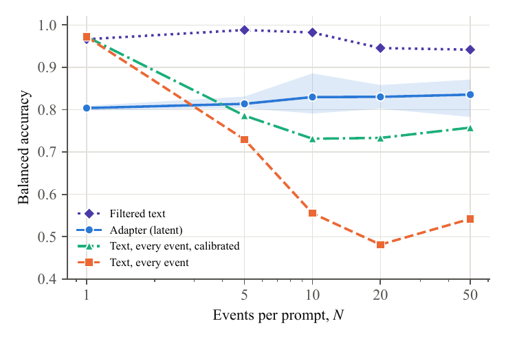
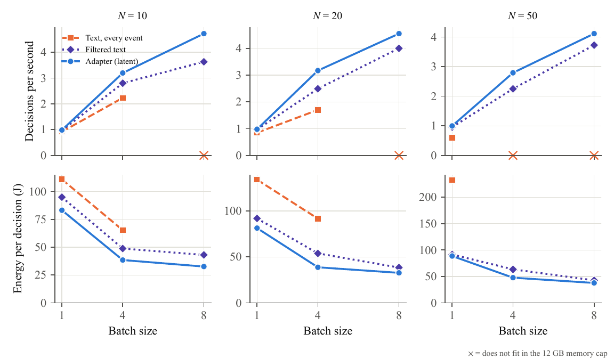

# Efficient Communication Between a Non-Transformer Perception Agent and a Frozen Gemma Language Model

A heartbeat classifier has to tell a frozen language model what it saw. It can write the events out as text, send a
filtered text message, or skip text and write **virtual tokens** straight into the model's input embeddings. This project
measures what each channel costs and what it preserves, on one 12 GB consumer GPU.

**Status:** manuscript in preparation (journal submission planned for October 2026). Every number in the paper is
rebuilt from this repository.

## What this project demonstrates

- **A latent channel into a frozen LLM.** A linear adapter maps each event's 32-d vector from a CNN-LSTM to four
  virtual tokens in Gemma 4 E4B's embedding space, including its per-layer input embeddings, with no change to the
  language model.
- **Fair baselines.** Compact JSON text, a sender-side filter that lists only abnormal beats, and both calibrated on
  validation data, so the latent channel is compared against strong text alternatives, not a strawman.
- **Edge-systems measurement.** 4-bit inference under schema-constrained decoding, batched serving with prefix caching,
  GPU energy from NVML sampled at 100 Hz, and a memory cap so a batch that does not fit is recorded instead of paging.
- **Rigorous evaluation.** Held-out patients, three training runs, patient-cluster bootstrap, non-inferiority tests,
  an analysis plan written before the test data were used, and an external test set run on a system frozen by
  SHA-256 hashes.
- **Reproducible engineering.** Resumable training and evaluation with atomic checkpoints, unit tests, and scripts that
  regenerate every table and figure in the paper from the committed results.

**Stack:** Python, PyTorch, Hugging Face Transformers, bitsandbytes, NVML, NumPy, SciPy, scikit-learn, WFDB, LaTeX.

## The system



The task is to report the most urgent triage tier among 1 to 50 heartbeats. Its answer is a fixed rule over the
sender's outputs, so every error belongs to the channel. It is a benchmark of communication fidelity, not of clinical
reasoning or clinical value.

## Results

**Cost.** Text grows with every event; the adapter and the filter stay flat. Against compact text, the adapter cuts
prompt processing by 24%, 50% and 78% at 10, 20 and 50 events, and saves 460 MB of context memory at 50 events.



**Accuracy.** The adapter holds about 0.83 balanced accuracy as events grow, against 0.73 for calibrated text at 10
and 20 events. Filtered text is more accurate still (0.11 to 0.17 higher), because the question is known in advance.



**Serving.** Under batching, the adapter's median throughput is 10 to 30% higher than filtered text and its median
energy per decision 12 to 28% lower. Text with every event does not fit in memory at larger batches. (Filtered text at a
batch of eight is measured only on the batches that fit, its shortest prompts.)



| Also tested | Result |
|---|---|
| Recoverability | heart rate, interval and abnormal-run information is decodable from the virtual tokens |
| External test (INCART, 75 records, frozen system) | adapter non-inferior and superior to calibrated text; not non-inferior to filtered text; first token 27 to 77% faster |
| Second sender (ResNet1D) | the same pattern largely holds |

**Takeaway:** when the receiver's question is known in advance, filter on the sender side and send text; a latent
channel earns its place when many events must be carried at a predictable cost. All results use one receiving model,
one GPU and one serving framework.

## Quick start

```bash
pip install torch==2.11.0 --index-url https://download.pytorch.org/whl/cu128
pip install -r requirements.txt
python scripts/make_paper_tables.py      # every table in the paper, from results/
python scripts/make_paper_figures.py     # every figure
```

Re-running the analyses and the full GPU pipeline is described step by step in
[docs/REPRODUCE.md](docs/REPRODUCE.md).

## Try it

`demo.py` picks a window of heartbeats from a test set, shows what the sender saw beat by beat, what each channel
sends, and how the frozen Gemma receiver answers through each one.

```bash
python data_prep.py                              # once: download MIT-BIH and build the splits
python demo.py --no-llm                          # CPU only: the window and the three messages, no Gemma
python demo.py                                   # an urgent 10-beat window through all three channels
python demo.py --n 50 --tier priority --pick 3   # another window: 1, 5, 10, 20 or 50 beats; routine/priority/urgent
python demo.py --record 208 --any-tier           # windows from one MIT-BIH record
python demo.py --split incart --n 20             # the external INCART test set (after incart_prep.py)
```

Without `--no-llm` it needs a CUDA GPU with about 10 GB free and access to
[Gemma 4 E4B](https://huggingface.co/google/gemma-4-E4B-it) (`huggingface-cli login`). Example output for an urgent
window whose one ventricular beat has confidence 0.957:

```
[A-compact]  tier: priority (WRONG)   | prompt 1106 tokens | answer 101 tokens in 16.6 s
[A-filtered] tier: urgent (correct)   | prompt 682 tokens  | answer 53 tokens in 8.6 s
[Adapter]    tier: priority (WRONG)   | prompt 553 tokens  | answer 59 tokens in 9.6 s
```

Compact text misread the confidence as below the 0.85 threshold, the failure the paper describes for long lists;
the filtered message, which lists only that beat, did not. Single windows vary, so try several with `--pick`; the
paper reports accuracy over 1,195 windows.

## Tests

```bash
pytest --ignore=tests/test_day2_baseline_arm.py --ignore=tests/test_day3_adapter.py   # 49 CPU tests, under a minute
pytest                                          # adds two GPU tests that load Gemma
python scripts/make_paper_tables.py             # rebuilds the tables and checks 21 numbers quoted in the paper's text
```

The unit tests cover the adapter, prompts, constrained decoding, resumable checkpoints and the data conversion.
The table script fails if a number in the paper no longer matches the result files.

## Repository layout

```
demo.py              Try one window through all three channels
perception/          Sender: CNN-LSTM with RR features, ResNet1D, event schema
reasoning/           Receiver: Gemma loader, multi-event adapter, prompts, constrained decoding
p1_item7_*.py        Pipeline: test windows, adapter training, evaluation, calibration, timing
p1_*_analysis.py     Analyses that produce the paper's numbers
p1_serving.py        Batched serving benchmark (throughput, memory, energy)
incart_prep.py, p1_incart_windows.py, p1_confirmatory_analysis.py    External INCART test
scripts/             Paper table and figure builders
results/             Per-window outputs and analysis results (JSON)
docs/                Paper source, analysis plan and change log, reproduction guide
tests/               Unit tests and two GPU integration tests
archive/             Development diagnostics and the dissertation-era code, kept for the record
```

## Data

- [MIT-BIH Arrhythmia Database](https://physionet.org/content/mitdb/1.0.0/) (PhysioNet, ODC-By), inter-patient split
  of de Chazal et al. (DS1 training, DS2 test).
- [St Petersburg INCART 12-lead Arrhythmia Database](https://physionet.org/content/incartdb/1.0.0/) (PhysioNet), used
  only as an external test set.

Raw data are not included; `data_prep.py` and `incart_prep.py` download or convert them. Gemma 4 E4B is used under
the [Gemma licence](https://huggingface.co/google/gemma-4-E4B-it).

## Licence

The code is released under the [MIT licence](LICENSE). The paper draft in `docs/paper/` is not covered by it, and the
datasets and the Gemma model keep their own licences.

## Citation

The paper is in preparation; a citation will be added here once it is published. Until then, please cite this
repository:

```
Tasbir, A. (2026). Efficient Communication Between a Non-Transformer Perception Agent and a Frozen Gemma Language
Model [Source code]. https://github.com/a1if/Heterogeneous-Multi-Agent-Edge-AI-for-Clinical-Decision-Support
```

## Author

Alif Tasbir. This work extends the author's MSc dissertation.
