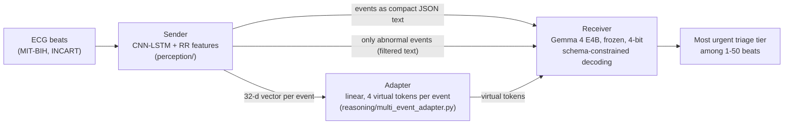

# Efficient Communication Between a Non-Transformer Perception Agent and a Frozen Gemma Language Model

Code, results and paper for a communication-fidelity benchmark of the channel between an ECG heartbeat classifier
and a frozen language model: plain text, a filtered text message, or a learned latent channel of virtual tokens.

**Status:** manuscript in preparation (journal submission planned for October 2026). Every number in the paper is
rebuilt from the files in this repository by two scripts (see [Reproduce](#reproduce)).

## The question

Agents built on language models usually talk to each other in text. When the sender is not a language model, for
example a convolutional network watching a sensor, text has to be written out, read back in, and paid for in prompt
tokens, time and energy on every decision. Latent communication replaces text with continuous vectors injected
directly into the receiver's input, but it has only been studied between transformers.

This project asks what each kind of channel **costs** and what it **preserves** when a non-transformer sender talks
to a frozen language model on edge hardware (one 12 GB consumer GPU):

| | Research question |
|---|---|
| RQ1 | Cost: how much prompt processing time, memory, throughput and energy does each channel need? |
| RQ2 | Accuracy: does the receiver still reach the right decision? |
| RQ3 | Recoverability: is event-level information still recoverable from the latent channel? |

## The system



- **Sender:** a CNN-LSTM heartbeat classifier with RR-interval features, trained on MIT-BIH (inter-patient split:
  DS1 for training, DS2 for testing). A ResNet1D sender is used as a second, independent sender.
- **Channels (arms):** compact JSON text; filtered text listing only abnormal beats; calibrated variants of both; and
  the multi-event adapter, a linear map from each event's 32-d vector to four virtual tokens in Gemma's embedding space.
- **Receiver:** Gemma 4 E4B, frozen and 4-bit quantised, with decoding constrained to the output schema.
- **Task:** report the most urgent triage tier among 1 to 50 heartbeats. The correct answer is a fixed rule over the
  sender's outputs, so every error is attributable to the channel, not to the receiver's clinical judgement. This is a
  benchmark of communication fidelity, not of clinical reasoning or clinical value.

## Main results

Held-out patients, three adapter training runs, patient-cluster bootstrap intervals (20,000 resamples), analysis plan
fixed before the test data were used.

| Finding | Result |
|---|---|
| Prompt-processing time, adapter vs compact text | **−24%, −50%, −78%** at 10, 20, 50 events |
| Context memory saved at 50 events | 460 MB |
| Balanced accuracy, adapter vs calibrated text | **0.83 vs 0.73** at 10 and 20 events (difference +0.10, 95% CI excludes 0) |
| Filtered text vs adapter | filtered text is 0.11 to 0.17 more accurate and as fast for single requests |
| Batched serving, adapter vs filtered text | median throughput 10 to 30% higher, median energy per decision 12 to 28% lower |
| Recoverability | heart rate, interval and abnormal-run information is decodable from the virtual tokens |
| External test (INCART, 75 records, analysis frozen in advance) | non-inferior and superior to calibrated text (H1, H2 confirmed); not non-inferior to filtered text (H3); first token 27 to 77% faster |
| Second sender (ResNet1D) | the same pattern largely holds |

**Practical rule:** when the receiver's question is known in advance, filter on the sender side and send text; a
latent channel earns its place when many events must be carried at a predictable cost.

Scope: one receiving model (Gemma 4 E4B), one GPU and one serving framework; whether the results transfer to other
receivers is untested.

## Repository layout

Only the code needed to understand the system and rebuild the paper is at the top level. Development diagnostics,
run queues and the supervisor report are kept, with their original paths, in [`archive/`](archive/).

```
perception/              Sender: CNN-LSTM (+RR features), ResNet1D, event schema, replay agent
reasoning/               Receiver side: Gemma loader, multi-event adapter, prompts, constrained decoding, targets
p1_item7_common.py       Shared pipeline: replay of a split through the sender, windows, arms
p1_item7_*.py            Pipeline steps: test windows, adapter training, evaluation, calibration, timing
p1_*_analysis.py         Analyses that turn raw outputs into the numbers in the paper (CPU)
p1_serving.py            Batched serving benchmark (throughput, memory, GPU energy)
incart_prep.py, p1_incart_windows.py, p1_confirmatory_analysis.py   External INCART test
p1_freeze.py             Freeze manifest (SHA-256 of code, checkpoints, calibration) for the INCART test
scripts/make_paper_tables.py, scripts/make_paper_figures.py         Every table and figure in the paper
results/                 Raw per-window outputs and analysis results (JSON)
docs/paper/              Paper source (LaTeX, elsarticle)
docs/analysis_plan.md    Analysis plan and its dated change log; docs/confirmatory_plan.md for INCART
tests/                   Unit tests (CPU) and two GPU integration tests
```

Some module names (`p1_step1_...`, `day7_...`, `ablation_common.py`) come from the dissertation this project grew out of;
they are kept because later steps import them and the frozen INCART manifest hashes them by path.

## Reproduce

### 1. Rebuild the paper's tables and figures (CPU, about a minute)

```bash
pip install -r requirements.txt
python scripts/make_paper_tables.py
python scripts/make_paper_figures.py
cd docs/paper && latexmk -pdf main.tex
```

Both scripts read only `results/`, re-check the numbers quoted in the text, and write `docs/paper/tables/` and
`docs/paper/figures/`.

| Paper item | Result file(s) | Produced by |
|---|---|---|
| Cost table | `p1_e3b_context_costs.json`, `p1_item7_ttd.json` | `p1_e3b_context_costs.py`, `p1_item7_ttd.py` |
| Accuracy table, accuracy figure | `p1_item7_r4_analysis.json` | `p1_item7_r4_analysis.py` |
| Filtered text | `p1_item7_filtered.json` | `p1_item7_filtered.py` |
| Serving table and figure | `p1_serving.json` | `p1_serving.py` |
| Recoverability | `p1_item7_r4_analysis.json`, `p1_item7_runlen.json` | `p1_item7_slot_decoder.py`, `p1_item7_runlen.py` |
| Second sender | `p1_second_sender_analysis.json` | `p1_second_sender_analysis.py` |
| Compression sweep, ablation | `p1_sweep_analysis.json`, `p1_dev27_kseeds.json`, `p1_dev26_ablation.json` | `p1_sweep_analysis.py`, `p1_seed_group_analysis.py --dev 27`, `--dev 26` |
| INCART tables | `p1_confirmatory_incart.json`, `p1_incart_timing_n50_capped.json` | `p1_confirmatory_analysis.py`, `p1_incart_timing_recheck.py` |
| Bandwidth | `p1_bandwidth.json` | `p1_bandwidth.py` |
| Learning curves | `p1_learning_curves.json` | `p1_learning_curves.py` |
| Position of the deciding beat | `p1_position_effect.json` | `scripts/position_effect.py` |

### 2. Re-run the analyses from the raw outputs (CPU)

Every analysis re-derives its numbers from the committed per-window outputs in `results/`. Each one was re-run from a
clean checkout and reproduced the committed result exactly. They run on the CPU but load the sender checkpoint, which
was saved on a GPU, so run them on a machine with CUDA. The first one also rebuilds the sender's replay cache
(about 4 minutes per split).

```bash
python p1_item7_r4_analysis.py                 # accuracy, cost, recoverability (about 16 min)
python p1_seed_group_analysis.py --dev 26      # side-input ablation (about 8 min)
python p1_seed_group_analysis.py --dev 27      # tokens per event, three runs (about 8 min)
python p1_sweep_analysis.py                    # compression sweep (about 4 min)
python p1_item7_runlen.py                      # abnormal-run recoverability (about 3 min)
python p1_confirmatory_analysis.py             # INCART hypotheses H1-H4 (about 1.5 min)
python p1_e3b_context_costs.py
python p1_bandwidth.py
python p1_learning_curves.py
python scripts/position_effect.py
P1_ENCODER=perception/checkpoints/resnet1d_rr_seed0.pt P1_ENCODER_TAG=_res python p1_second_sender_analysis.py   # needs the second sender's checkpoint (about 13 min)
```

### 3. Re-run everything (GPU)

Requirements: an NVIDIA GPU with 12 GB, a Hugging Face account with the
[Gemma licence](https://huggingface.co/google/gemma-4-E4B-it) accepted (`huggingface-cli login`), and PhysioNet access
for the data. Each step is resumable and writes to `results/`.

```bash
# Data: MIT-BIH (downloaded and split into DS1/DS2) and INCART (download incartdb 1.0.0 to data/incartdb/ first)
python data_prep.py

# Sender (checkpoint perception/checkpoints/cnn_lstm_rr_seed0.pt is included), then replay both splits through it
python train_perception_agent_rr.py --seed 0
python -c "from p1_item7_common import replay_split; replay_split('ds1'); replay_split('ds2')"

# DS2 test windows
python p1_item7_testset_v2.py

# Final adapter, three runs (checkpoints reasoning/checkpoints/p1_item7_mea_r4_seed{101,202,303}.pt are included)
python p1_item7_train.py --recipe r4 --seed 101     # and 202, 303

# DS2 evaluation: adapter runs and text arms, calibration logits, token counts, timing, serving
python p1_item7_eval.py --split ds2v2 --suffix r4 --arms MEA:r4_seed101 MEA:r4_seed202 MEA:r4_seed303 A-compact A-filtered
python p1_item7_calib.py collect && python p1_item7_calib.py analyse
python p1_item7_filtered.py collect --text-arm A-compact
python p1_item7_filtered.py collect --text-arm A-filtered
python p1_item7_filtered.py tokens && python p1_item7_filtered.py timing
python p1_item7_ttd.py
python p1_serving.py

# External test on INCART with the frozen system
python p1_freeze.py
python incart_prep.py
python -c "from p1_item7_common import replay_split; replay_split('incart')"
python p1_incart_windows.py
python p1_item7_eval.py --split incart --arms MEA:r4_seed101 MEA:r4_seed202 MEA:r4_seed303
python p1_item7_eval.py --split incart --stop-at-tier --arms A-compact A-filtered
python p1_item7_filtered.py collect --text-arm A-compact --split incart
python p1_item7_filtered.py collect --text-arm A-filtered --split incart
python p1_item7_filtered.py timing --split incart
python p1_incart_timing_recheck.py
python p1_confirmatory_analysis.py
```

The second sender uses the same commands with `P1_ENCODER=perception/checkpoints/resnet1d_rr_seed0.pt` and
`P1_ENCODER_TAG=_res` set, the evaluation suffix `r4_res` and arms `MEA:r4_res_seed101` and so on (train the sender
with `python train_perception_agent_rr.py --arch resnet1d_rr --seed 0`; its checkpoints are not included).
Ablation and compression variants use `p1_item7_train.py --recipe r4hn | r4k1 | r4k2 | r4k8`.

Reference timings on an RTX 5070 (12 GB): one DS2 evaluation of all arms about 10 hours; INCART about 10 hours;
serving benchmark 3 to 4 hours.

### Tests

```bash
pytest                                                               # all tests
pytest --ignore=tests/test_day2_baseline_arm.py --ignore=tests/test_day3_adapter.py   # CPU only (49 tests)
```

## Data

- [MIT-BIH Arrhythmia Database](https://physionet.org/content/mitdb/1.0.0/) (PhysioNet, ODC-By), inter-patient split
  of de Chazal et al. (DS1 training, DS2 test).
- [St Petersburg INCART 12-lead Arrhythmia Database](https://physionet.org/content/incartdb/1.0.0/) (PhysioNet), used
  only as an external test set.

Raw data are not included; the scripts above download or convert them.

## Methods notes

- **Analysis plan.** The hypotheses, margins and tests were written down before each test set was used, in
  [`docs/analysis_plan.md`](docs/analysis_plan.md), with a dated log of every later change and why.
- **Freeze.** Before the INCART test, code, checkpoints and calibration were fixed by SHA-256 hashes in
  `results/p1_freeze_manifest.json` (git tag `r4-confirmatory`).
- **Statistics.** Patient-cluster bootstrap (20,000 resamples), non-inferiority margin −0.05, hypotheses tested in a
  fixed sequence at α = 0.05.
- **Energy.** GPU board power from NVML sampled at 100 Hz during each generation call and integrated with the
  trapezoid rule; GPU memory capped at 90% so that a batch that does not fit is recorded instead of paging.

## Author

Alif Tasbir. This work extends the author's MSc dissertation.
